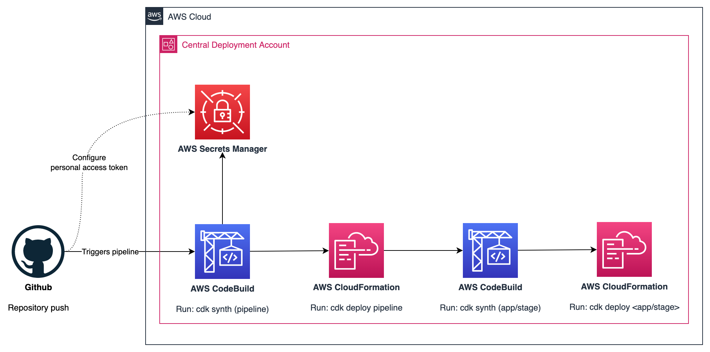

# CDK Pipelines Starter Kit

Starter kit for [AWS Cloud Development Kit (AWS CDK)](https://aws.amazon.com/cdk/) pipelines. It generates a single-account CDK Pipeline project.
For details how to extend it to multi-account setups, please take a look at the [resources](#resources).

## Architecture overview


## Project structure
```
infrastructure/                 -- Contains all the infrastructure settings
├── index.ts                    -- Base setup for the underlying stack
├── config.ts                   -- Configurations
└── pipeline/
    ├── pipeline-stack.ts       -- Setup the CDK pipeline
    ├── development-stage.ts    -- Development stage, this become part of the pipeline. Could be used for testing, production, ... stages
    └── application-stack.ts    -- The application stack
```

## Usage
This project relies on [copier](https://copier.readthedocs.io/en/latest/), for installation instructions look [here](https://github.com/copier-org/copier/#installation).

### Scaffold your project
```
copier https://github.com/moralesl/cdk-pipeline-starter-kit path/to/destination
```
Afterwards take a look into the generated [README.md](README.md.jinja) for further instructions to setup the pipeline.


## Resources
* [Continuous integration and delivery (CI/CD) using CDK Pipelines](https://docs.aws.amazon.com/cdk/v2/guide/cdk_pipeline.html)
* [CDK Pipelines: Continuous delivery for AWS CDK applications](https://aws.amazon.com/blogs/developer/cdk-pipelines-continuous-delivery-for-aws-cdk-applications/)
